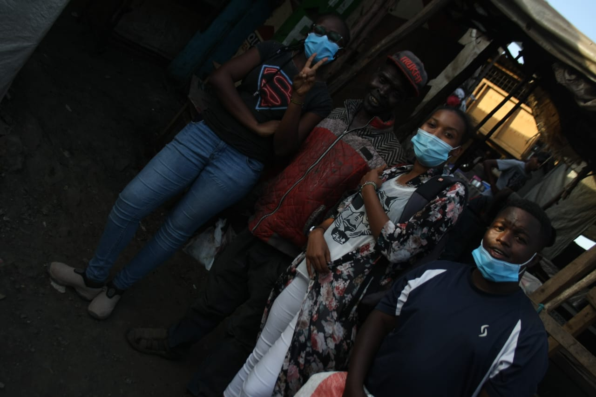

On 5th February 2021, the AfriKana group distributed packaged fruit to the
street families around Githurai town. With help from friends, we bought and packaged fruits
which we then went to distribute. This was our first official
act of charity that we had done together as a group an it gave us so much joy to see the smiles
in the people's faces. We set aside this activity to be carried out atleast twice a month.
